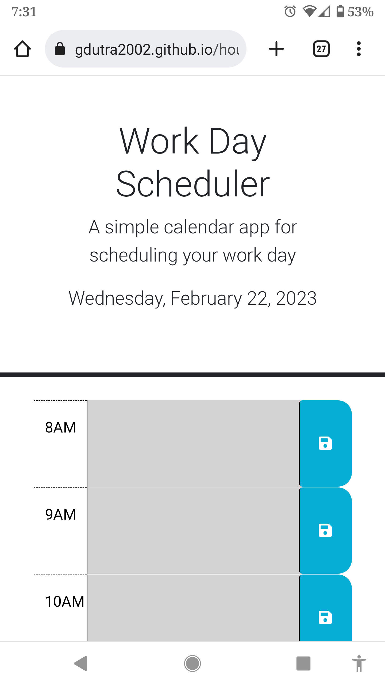

# hourpincher

## Description

In keeping track of our lives, using a day planner is crucial to successfuly meeting our daily obligations.  By using an online schedule, we can share our plans and have a communitty schedule for people to be aware of events and tasks throughout the day, updated in real time. This schedule is independent from any subscribed callender, thus useful like a tear off day planner on a local machine.
Enjoy!

## Installation

https://gdutra2002.github.io/hourpincher/

## Usage

## Credits

https://github.com/coding-boot-camp/crispy-octo-meme
https://bootcamp.ucdavis.edu/
https://ucdavis.bootcampcontent.com/ucdavis-boot-camp/UCD-VIRT-FSF-PT-12-2022-U-LOLC/-/tree/main/05-Third-Party-APIs

## License

See MIT license

## Badges

## How to Contribute
Link to source:
https://github.com/gdutra2002
Contact author:
https://linkedin.com/in/gary-e-dutra-15357940